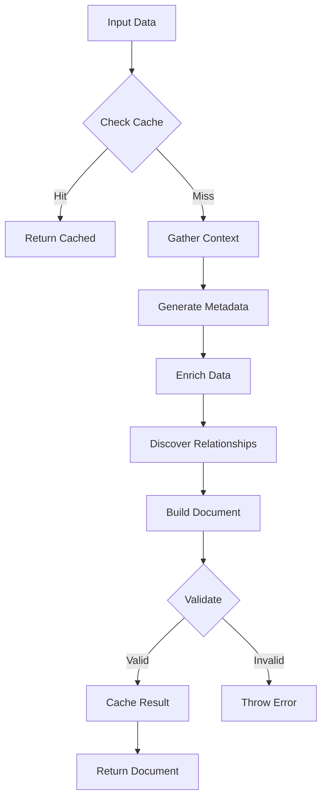

# Data Preparation Agent - Configuration System Guide

## Table of Contents

1. [Overview](#overview)
2. [Architecture](#architecture)
3. [Core Components](#core-components)
4. [Configuration Structure](#configuration-structure)
5. [Usage Instructions](#usage-instructions)
6. [API Reference](#api-reference)
7. [Best Practices](#best-practices)
8. [Performance Optimization](#performance-optimization)

---

## Overview

The Data Preparation Agent is a sophisticated AI-powered service that intercepts data before it reaches the Brain Service, enriching it with context, metadata, and relationship information. The configuration system allows for flexible, entity-specific customization of how data is processed.

### Key Features

- **Multi-Source Context Gathering**: Pulls context from PayloadCMS, Brain Service, Open MongoDB, and project data
- **LLM-Powered Metadata Generation**: Uses multi-sequence prompts to generate rich, contextual metadata
- **Automatic Relationship Discovery**: Identifies and creates relationships between entities
- **Caching & Queue Support**: Built-in Redis caching and queue management for performance
- **Validation System**: Comprehensive validation before data storage
- **Feature Flags**: Granular control over agent capabilities

### What It Does

```
Input Data → Data Preparation Agent → Enriched Brain Document
     ↓              ↓                          ↓
 Raw Entity    Context Gathering         Searchable Text
               Metadata Generation        Rich Metadata
               Relationship Discovery     Entity Relationships
               Validation                 Quality Assured
```

---

## Architecture

### System Overview

```
┌─────────────────────────────────────────────────────────────┐
│                  Data Preparation Agent                      │
├─────────────────────────────────────────────────────────────┤
│                                                              │
│  ┌──────────────┐  ┌──────────────┐  ┌──────────────┐     │
│  │   Context    │  │   Metadata   │  │     Data     │     │
│  │   Gatherer   │→│   Generator  │→│   Enricher   │     │
│  └──────────────┘  └──────────────┘  └──────────────┘     │
│         ↓                  ↓                  ↓             │
│  ┌──────────────┐  ┌──────────────┐  ┌──────────────┐     │
│  │ Relationship │  │  Validator   │  │    Cache     │     │
│  │  Discoverer  │→│              │→│   Manager    │     │
│  └──────────────┘  └──────────────┘  └──────────────┘     │
│                                              ↓             │
│                                       Brain Document       │
└─────────────────────────────────────────────────────────────┘
```

### Processing Flow



### Data Sources

1. **PayloadCMS** - Structured project data (characters, scenes, locations, etc.)
2. **Brain Service** - Existing knowledge graph entities and relationships
3. **Open MongoDB** - Custom project-specific collections
4. **Project Context** - Project metadata (genre, tone, themes, etc.)

---

## Core Components

### 1. Context Gatherer

Collects context from multiple sources in parallel.

**Responsibilities:**
- Query PayloadCMS for related entities
- Search Brain Service for similar content
- Fetch custom data from Open MongoDB
- Build unified context object

**Output:**
```typescript
{
  project: { id, name, slug, type, genre, tone, themes },
  payload: { characters, scenes, locations, episodes, concepts },
  brain: { existingEntities, relatedNodes, similarContent },
  opendb: { collections, stats },
  related: { characters, scenes, locations, concepts, episodes }
}
```

### 2. Metadata Generator

Uses LLM with multi-sequence prompts to generate metadata.

**Sequence 1: Analyze Entity**
- Determines optimal metadata schema
- Considers entity type and context

**Sequence 2: Extract Metadata**
- Extracts values based on schema
- Contextualizes with project data

**Sequence 3: Generate Summary**
- Creates searchable text summary
- Includes keywords and relationships

**Sequence 4: Identify Relationships**
- Suggests logical entity relationships
- Provides confidence scores

### 3. Data Enricher

Enriches entity data with related information.

**Enrichment Types:**
- Related entity data
- Context summaries
- Quality scores
- Lineage information

### 4. Relationship Discoverer

Discovers and creates entity relationships.

**Common Relationship Types:**
- `APPEARS_IN` - Character in scene
- `LIVES_IN` - Character in location
- `RELATES_TO` - Character to character
- `CONTAINS` - Scene contains character
- `LOCATED_IN` - Scene in location
- `FOLLOWS/PRECEDES` - Sequential scenes

### 5. Validator

Validates documents before storage.

**Validation Checks:**
- Required fields (id, type, project_id, text)
- Text length (10-10,000 characters)
- Metadata presence
- Relationship structure

### 6. Cache Manager

Dual-layer caching (memory + Redis).

**Cache Layers:**
- **Memory Cache**: Instant access for recent items
- **Redis Cache**: Persistent, shared cache

**TTL Defaults:**
- Project Context: 5 minutes
- Documents: 1 hour
- Entities: 30 minutes

### 7. Queue Manager

Async job processing with BullMQ.

**Features:**
- Concurrency control
- Retry logic (3 attempts)
- Job status tracking
- Priority queues

---

## Configuration Structure

### Agent Configuration

```typescript
interface AgentConfig {
  // LLM Configuration
  llm: {
    apiKey: string          // OpenRouter API key
    baseUrl: string         // API base URL
    defaultModel: string    // Primary model (claude-sonnet-4.5)
    backupModel?: string    // Fallback model
  }

  // Brain Service Configuration
  brain: {
    apiUrl: string          // Brain service URL
    apiKey: string          // Brain API key
  }

  // Redis Configuration
  redis: {
    url: string             // Redis connection URL
  }

  // Cache TTL Settings (seconds)
  cache: {
    projectContextTTL: number   // Default: 300 (5 min)
    documentTTL: number         // Default: 3600 (1 hour)
    entityTTL: number           // Default: 1800 (30 min)
  }

  // Queue Configuration
  queue: {
    concurrency: number         // Default: 5
    maxRetries: number          // Default: 3
  }

  // Feature Flags
  features: {
    enableCaching: boolean              // Default: true
    enableQueue: boolean                // Default: true
    enableValidation: boolean           // Default: true
    enableRelationshipDiscovery: boolean // Default: true
  }
}
```

### Default Configuration

```typescript
const defaultConfig: AgentConfig = {
  llm: {
    apiKey: process.env.OPENROUTER_API_KEY!,
    baseUrl: process.env.OPENROUTER_BASE_URL || 'https://openrouter.ai/api/v1',
    defaultModel: process.env.OPENROUTER_DEFAULT_MODEL || 'anthropic/claude-sonnet-4.5',
    backupModel: process.env.OPENROUTER_BACKUP_MODEL,
  },
  brain: {
    apiUrl: process.env.BRAIN_SERVICE_BASE_URL || 'https://brain.ft.tc',
    apiKey: process.env.BRAIN_SERVICE_API_KEY!,
  },
  redis: {
    url: process.env.REDIS_URL || 'redis://localhost:6379',
  },
  cache: {
    projectContextTTL: 300,     // 5 minutes
    documentTTL: 3600,          // 1 hour
    entityTTL: 1800,            // 30 minutes
  },
  queue: {
    concurrency: 5,
    maxRetries: 3,
  },
  features: {
    enableCaching: true,
    enableQueue: true,
    enableValidation: true,
    enableRelationshipDiscovery: true,
  },
}
```

---

## Usage Instructions

### Basic Usage

```typescript
import { getDataPreparationAgent } from '@/lib/agents/data-preparation/agent'

// Get singleton instance with default config
const agent = getDataPreparationAgent()

// Prepare data
const brainDocument = await agent.prepare(data, {
  projectId: 'proj_123',
  entityType: 'character',
  sourceCollection: 'characters',
  sourceId: 'char_456',
  userId: 'user_789',
})

// Use the enriched document
await brainClient.store(brainDocument)
```

### Custom Configuration

```typescript
import { DataPreparationAgent } from '@/lib/agents/data-preparation/agent'

const agent = new DataPreparationAgent({
  llm: {
    apiKey: process.env.CUSTOM_LLM_KEY!,
    baseUrl: 'https://custom-llm.api',
    defaultModel: 'gpt-4',
  },
  brain: {
    apiUrl: 'https://custom-brain.api',
    apiKey: process.env.CUSTOM_BRAIN_KEY!,
  },
  redis: {
    url: 'redis://custom-redis:6379',
  },
  cache: {
    projectContextTTL: 600,    // 10 minutes
    documentTTL: 7200,         // 2 hours
    entityTTL: 3600,           // 1 hour
  },
  queue: {
    concurrency: 10,
    maxRetries: 5,
  },
  features: {
    enableCaching: true,
    enableQueue: true,
    enableValidation: true,
    enableRelationshipDiscovery: true,
  },
})
```

### Async Processing

```typescript
// Queue for later processing
const jobId = await agent.prepareAsync(data, {
  projectId: 'proj_123',
  entityType: 'scene',
})

console.log('Job queued:', jobId)
// Process continues in background
```

### Batch Processing

```typescript
// Process multiple items efficiently
const items = [
  { data: character1, options: { projectId: 'proj_123', entityType: 'character' } },
  { data: character2, options: { projectId: 'proj_123', entityType: 'character' } },
  { data: scene1, options: { projectId: 'proj_123', entityType: 'scene' } },
]

const results = await agent.prepareBatch(items)
console.log('Processed:', results.length, 'items')
```

### Skip Cache

```typescript
// Force fresh processing
const document = await agent.prepare(data, {
  projectId: 'proj_123',
  entityType: 'character',
  skipCache: true,  // Bypass cache
})
```

---

## API Reference

### DataPreparationAgent

#### `prepare(data: any, options: PrepareOptions): Promise<BrainDocument>`

Main method to prepare data for Brain Service.

**Parameters:**
- `data` - Raw entity data
- `options` - Preparation options

**Returns:** Enriched Brain document

**Throws:** Error if validation fails

#### `prepareAsync(data: any, options: PrepareOptions): Promise<string>`

Queue data for async processing.

**Returns:** Job ID for tracking

**Throws:** Error if queue feature is disabled

#### `prepareBatch(items: Array<{data, options}>): Promise<BrainDocument[]>`

Process multiple items in parallel.

**Returns:** Array of enriched documents

### PrepareOptions

```typescript
interface PrepareOptions {
  projectId: string          // Required: Project identifier
  entityType: string         // Required: Entity type (character, scene, etc.)
  sourceCollection?: string  // PayloadCMS collection name
  sourceId?: string         // Source entity ID
  async?: boolean           // Use async processing
  skipCache?: boolean       // Bypass cache
  customRules?: EntityRule  // Custom entity rules (future)
  userId?: string           // User who created this
  createdByType?: 'user' | 'agent'
}
```

### BrainDocument

```typescript
interface BrainDocument {
  id: string                      // Unique brain ID
  type: string                    // Entity type
  project_id: string             // Project ID
  text: string                   // Searchable text
  metadata: Record<string, any>  // Rich metadata
  relationships: Relationship[]  // Entity relationships
}
```

### Relationship

```typescript
interface Relationship {
  type: string                    // Relationship type
  target: string                  // Target entity ID
  targetType?: string            // Target entity type
  properties?: Record<string, any>
  confidence?: number            // 0-1 confidence score
  reasoning?: string             // Why this relationship exists
}
```

---

## Best Practices

### 1. Configuration Management

**DO:**
- Use environment variables for sensitive data
- Set appropriate TTL values based on data volatility
- Enable caching for better performance
- Use reasonable concurrency limits

**DON'T:**
- Hardcode API keys
- Set TTL too low (increases load)
- Disable caching in production
- Set concurrency too high (overwhelms services)

### 2. Entity Processing

**DO:**
- Provide complete entity data
- Include projectId in all requests
- Use descriptive entityType names
- Set appropriate sourceCollection

**DON'T:**
- Send incomplete data
- Mix entity types in batch operations
- Skip required fields
- Use generic entity types

### 3. Error Handling

```typescript
try {
  const document = await agent.prepare(data, options)
  await brainClient.store(document)
} catch (error) {
  if (error.message.includes('Validation failed')) {
    // Handle validation errors
    console.error('Invalid data:', error.message)
  } else if (error.message.includes('LLM')) {
    // Handle LLM errors
    console.error('LLM generation failed:', error.message)
  } else {
    // Handle other errors
    console.error('Preparation failed:', error.message)
  }
}
```

### 4. Performance Optimization

**Caching Strategy:**
- Enable caching for production
- Set TTL based on update frequency
- Clear cache on significant updates
- Monitor cache hit rates

**Batch Processing:**
- Group similar entities together
- Limit batch size to 10-20 items
- Use async processing for large batches
- Monitor queue depth

**LLM Optimization:**
- Use appropriate temperature settings
- Limit token usage with maxTokens
- Monitor token consumption
- Use backup models for cost savings

### 5. Monitoring

**Key Metrics:**
- Processing duration
- Token usage
- Cache hit rate
- Relationship discovery rate
- Error rates
- Queue depth

**Logging:**
```typescript
console.log('[DataPrepAgent] Metrics:', {
  duration: 1234,
  projectId: 'proj_123',
  entityType: 'character',
  metadataFields: 12,
  relationships: 5,
  tokensUsed: 3456,
  cacheHit: false,
})
```

---

## Performance Optimization

### Caching Strategy

**Multi-Layer Cache:**
1. **Memory Cache**: Fast, in-process cache
2. **Redis Cache**: Persistent, shared cache

**Cache Keys:**
```
prep:{projectId}:{entityType}:{entityId}
project:{projectId}
```

**TTL Guidelines:**
- **Static Data**: 1 hour+
- **Dynamic Data**: 5-30 minutes
- **Real-time Data**: Disable cache

### Queue Optimization

**Concurrency Settings:**
- **Development**: 1-3 workers
- **Production**: 5-10 workers
- **High-volume**: 10-20 workers

**Retry Strategy:**
- Max retries: 3
- Exponential backoff
- Dead letter queue for failures

### LLM Optimization

**Token Management:**
- Use minimal prompts
- Limit context size
- Set appropriate maxTokens
- Monitor token usage

**Model Selection:**
- Primary: claude-sonnet-4.5 (quality)
- Backup: gpt-3.5-turbo (cost)
- Fallback: Use cached results

### Database Optimization

**Query Optimization:**
- Limit results (10-20 items)
- Use depth: 0 for minimal data
- Index frequently queried fields
- Parallel queries where possible

**Connection Pooling:**
- Reuse connections
- Close idle connections
- Monitor connection count

---

## Troubleshooting

### Common Issues

**Issue: Cache not working**
- Check Redis connection
- Verify TTL settings
- Check feature flag

**Issue: LLM errors**
- Verify API key
- Check rate limits
- Try backup model

**Issue: Slow processing**
- Enable caching
- Reduce context size
- Increase concurrency

**Issue: Validation failures**
- Check required fields
- Verify text length
- Validate relationships

### Debug Mode

```typescript
// Enable detailed logging
process.env.DEBUG = 'data-prep-agent:*'

// Check cache status
const cached = await agent.cache.get(key)
console.log('Cached:', cached)

// Monitor queue
const queueStats = await agent.queue.getStats()
console.log('Queue:', queueStats)
```

---

## See Also

- [Configuration Examples](/mnt/d/Projects/aladdin/docs/agents/configuration-examples.md)
- [Migration Guide](/mnt/d/Projects/aladdin/docs/agents/configuration-migration.md)
- [Troubleshooting Guide](/mnt/d/Projects/aladdin/docs/agents/configuration-troubleshooting.md)
- [Example Code](/mnt/d/Projects/aladdin/src/lib/agents/data-preparation/config/examples/)
