# Phase 5 Configuration System - Architecture Diagrams

**Version**: 1.0.0
**Date**: 2025-10-01
**Companion to**: phase-5-configuration-architecture.md

---

## System Architecture Overview

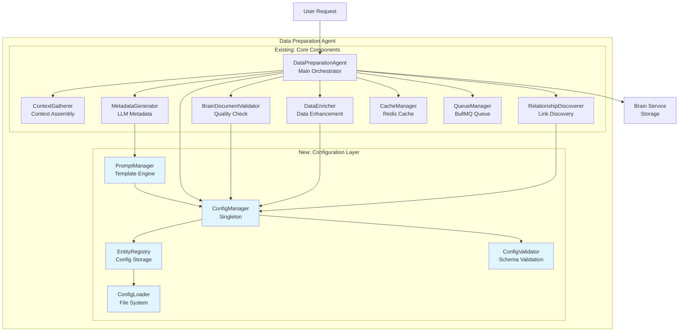

---

## Configuration Loading Flow

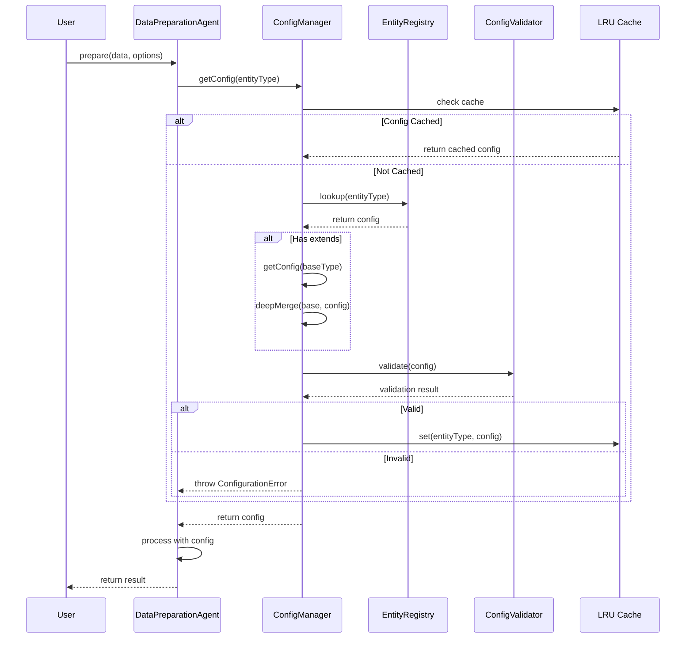

---

## Configuration Inheritance Chain

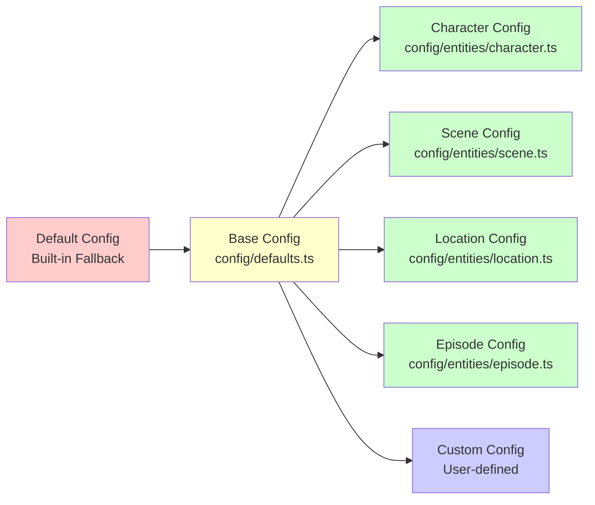

---

## Entity Configuration Structure

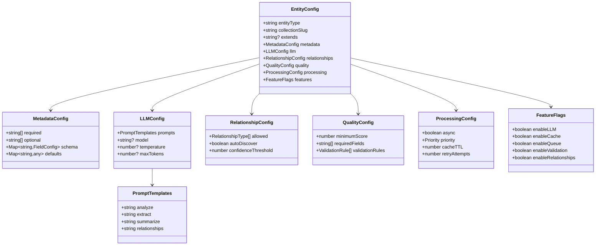

---

## Validation Pipeline

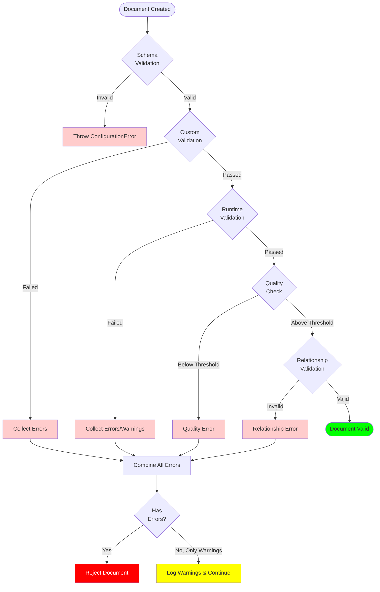

---

## Prompt Template Processing

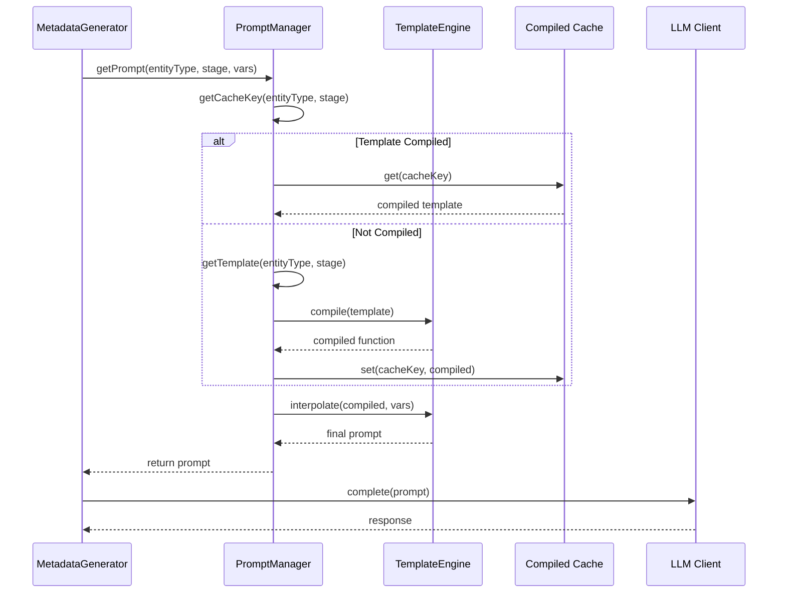

---

## Configuration Hot Reload (Development)

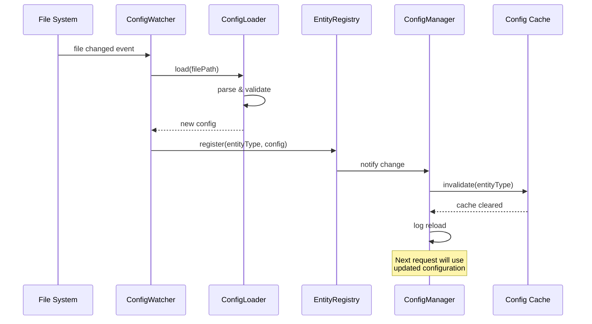

---

## Performance Optimization Flow

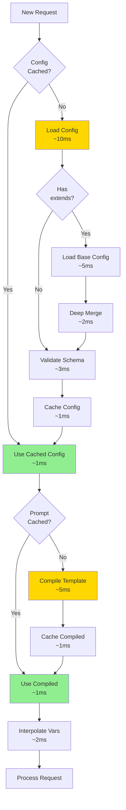

---

## Security Architecture

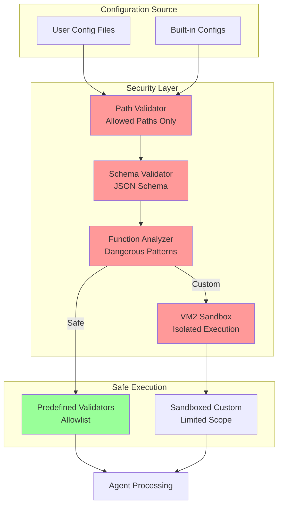

---

## Migration Phases

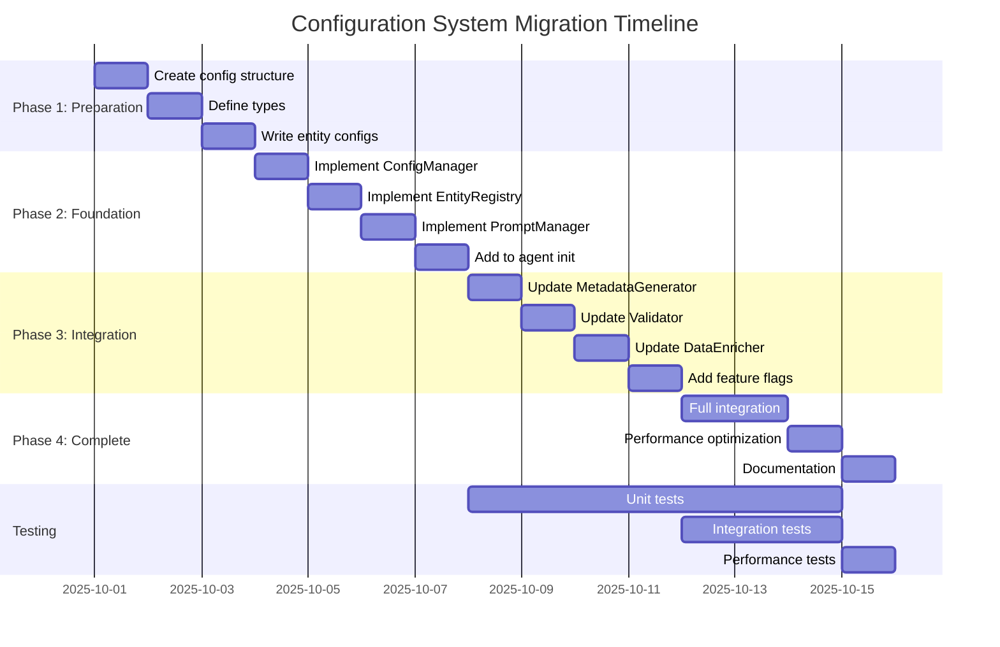

---

## Component Interaction Matrix

| Component | ConfigManager | PromptManager | EntityRegistry | Validator |
|-----------|--------------|---------------|----------------|-----------|
| **DataPreparationAgent** | Gets entity configs | - | - | - |
| **MetadataGenerator** | - | Gets prompts | - | - |
| **DataEnricher** | Gets quality thresholds | - | - | - |
| **RelationshipDiscoverer** | Gets relationship rules | - | - | - |
| **BrainDocumentValidator** | Gets validation rules | - | - | Uses |
| **ConfigManager** | - | Provides prompts | Loads configs | Validates configs |
| **PromptManager** | Reads config | - | - | - |

---

## File Structure

```
src/lib/agents/data-preparation/
├── config/
│   ├── types.ts                    # Type definitions
│   ├── defaults.ts                 # Base configuration
│   ├── manager.ts                  # ConfigManager class
│   ├── validator.ts                # ConfigValidator class
│   ├── loader.ts                   # ConfigLoader class
│   ├── entities/
│   │   ├── index.ts               # Export all configs
│   │   ├── character.ts           # Character config
│   │   ├── scene.ts               # Scene config
│   │   ├── location.ts            # Location config
│   │   ├── episode.ts             # Episode config
│   │   ├── dialogue.ts            # Dialogue config
│   │   └── concept.ts             # Concept config
│   ├── prompts/
│   │   ├── manager.ts             # PromptManager class
│   │   ├── engine.ts              # TemplateEngine class
│   │   └── cache.ts               # Prompt caching
│   └── index.ts                    # Main exports
├── agent.ts                        # Updated agent
├── metadata-generator.ts           # Updated generator
├── validator.ts                    # Updated validator
├── data-enricher.ts               # Updated enricher
└── relationship-discoverer.ts     # Updated discoverer
```

---

## Memory and Performance Profile

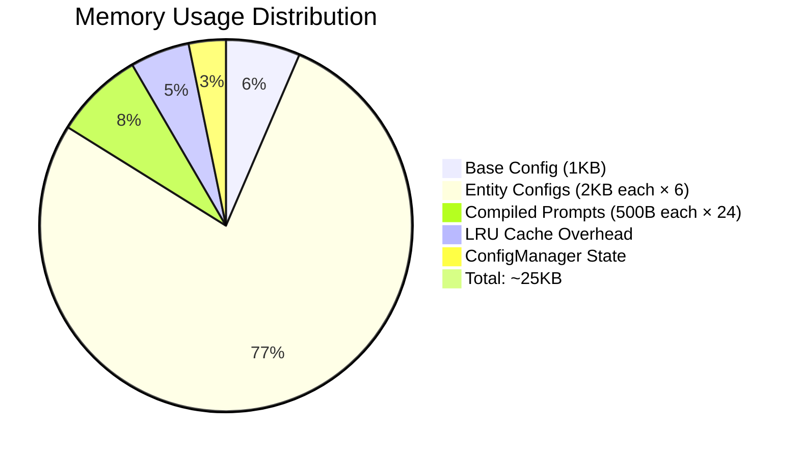

---

## Error Handling Flow

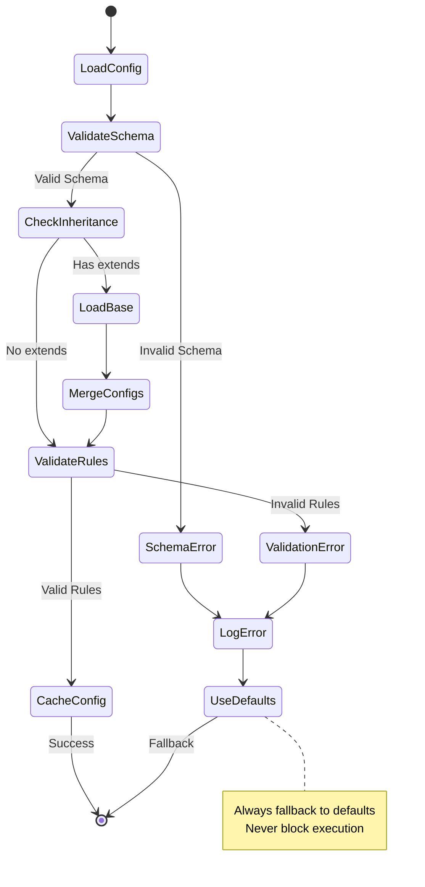

---

## Extensibility Points

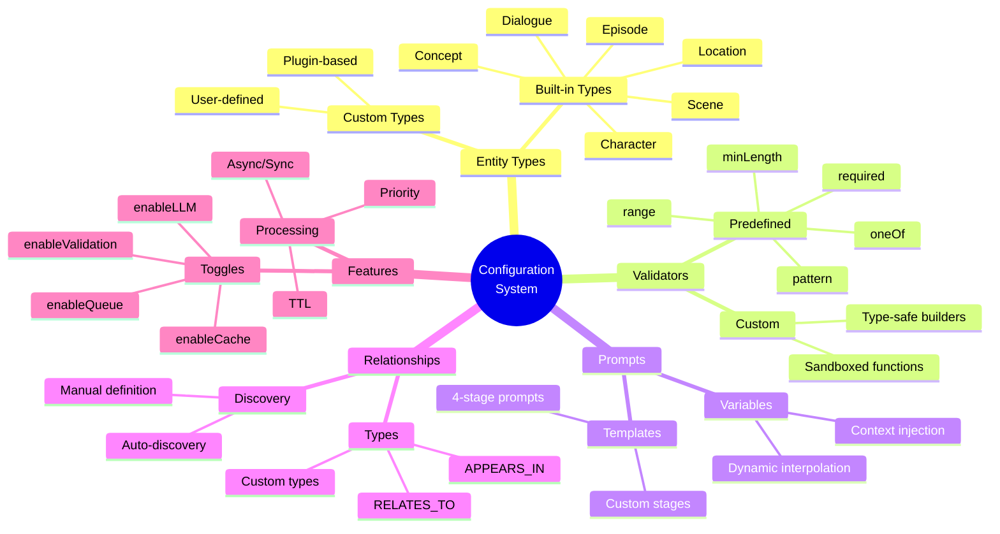

---

## Summary

These diagrams provide visual representations of:

1. **System Architecture**: Overall structure and component relationships
2. **Data Flow**: How data moves through the configuration system
3. **Inheritance**: Configuration inheritance chain
4. **Processing**: Request processing pipeline
5. **Security**: Security layers and validation
6. **Performance**: Optimization strategies and timings
7. **Migration**: Implementation phases and timeline

All diagrams use standard notation (Mermaid) for consistency and can be rendered in most documentation viewers.

---

**Related Documents**:
- phase-5-configuration-architecture.md (Main architecture document)
- PHASE_5_CONFIGURATION_PLAN.md (Implementation plan)

**Diagram Tools**:
- Mermaid (https://mermaid.js.org/)
- GitHub/GitLab native rendering
- VS Code Mermaid extensions
