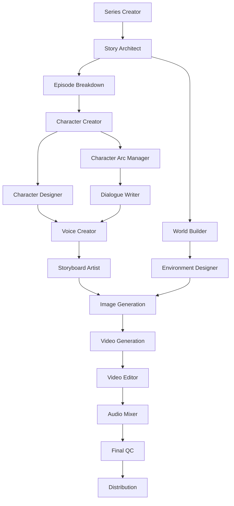
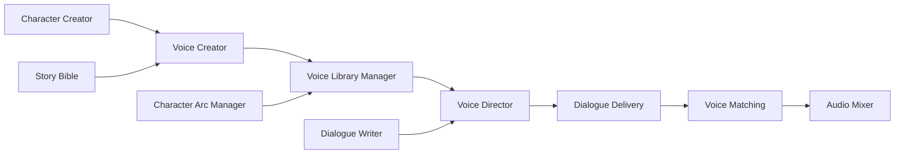
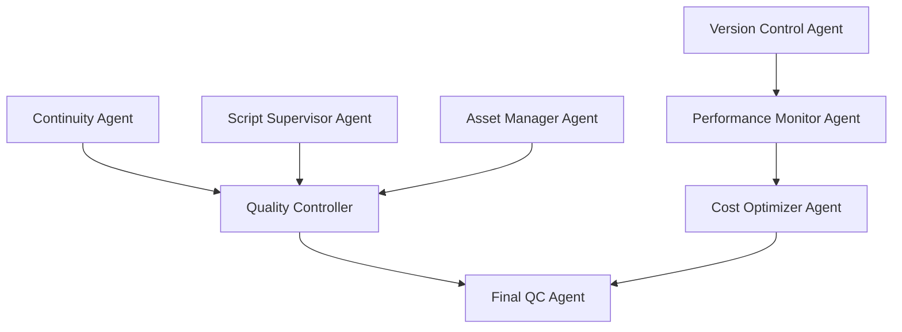

# Movie Generation Platform - AI Agent System

**Last Updated**: January 2025
**Status**: ✅ **IMPLEMENTED** - @codebuff/sdk Architecture
**Implementation**: 35+ agents configured and operational

## 🤖 Complete AI Movie Production Agent System

The platform features **35+ specialized AI agents** working together to produce complete movies from concept to distribution. Each agent is powered by **@codebuff/sdk** with specific prompts, tools, and workflows designed for particular aspects of movie production.

### **Architecture**
- **Agent Framework**: @codebuff/sdk (hierarchical coordination)
- **Knowledge Validation**: brain.ft.tc (Neo4j + Jina AI)
- **Task Management**: tasks.ft.tc (BullMQ + Redis)
- **Coordination**: Built-in hierarchical (Master → Dept Heads → Specialists)

## 🎭 Agent Roster by Department

### **Pre-Production Agents (14 agents)**

#### **Story Development (5 agents)** ✅ Implemented
| Agent | Role | Status | Specialization |
|-------|------|--------|----------------|
| **Story Architect** | Overarching narrative arc across episodes | ✅ Operational | Narrative structure and continuity |
| **Episode Planner** | Individual episode structure, beats, pacing | ✅ Operational | Scene-level planning |
| **Dialogue Writer** | Character voice consistency, natural conversation | ✅ Operational | Character-specific dialogue |
| **World Builder** | Universe rules, geography, culture, history | ✅ Operational | Setting and environment creation |
| **Theme Analyzer** | Thematic consistency, symbolism, motifs | ✅ Operational | Theme and meaning analysis |

#### **Character & Casting (1 agent)** ✅ Implemented
| Agent | Role | Status | Specialization |
|-------|------|--------|----------------|
| **Hair Stylist** | Character hair design and styling | ✅ Operational | Hair and styling specialist |

**Note**: Additional character specialists (Character Creator, Designer, Voice Creator, etc.) can be added as needed using the same @codebuff/sdk framework.

#### **Visual Design (5 agents)** ✅ Implemented
| Agent | Role | Status | Specialization |
|-------|------|--------|----------------|
| **Concept Artist** | Visual mood boards, style guides, artistic direction | ✅ Operational | Overall visual style |
| **Environment Designer** | Locations, sets, architectural elements | ✅ Operational | Set and location design |
| **Storyboard Artist** | Script to visual sequence conversion | ✅ Operational | Scene visualization |
| **Lighting Designer** | Lighting setup, mood lighting, time of day | ✅ Operational | Lighting and atmosphere |
| **Camera Operator** | Shot framing, camera movement, lens selection | ✅ Operational | Cinematographic execution |

### **Production Planning Agents (5 agents)**

#### **Scene Planning**
| Agent | Role | Specialization |
|-------|------|----------------|
| **Scene Director** | Blocking, character positioning, choreography | Scene coordination |
| **Cinematographer** | Lighting mood, camera techniques, visual style | Camera and lighting design |
| **Continuity** | Visual consistency between shots and scenes | Quality assurance |
| **Production Manager** | Task scheduling, dependencies, resources | Project coordination |
| **Quality Controller** | Content review for consistency and quality | Quality management |

### **Production Agents (11+ agents)**

#### **Content Generation (6 agents)**
| Agent | Role | Technology Integration |
|-------|------|----------------------|
| **Image Generation** | Concept art, character designs, environments | FAL.ai integration |
| **Video Generation** | 7-second video segments from storyboards | Advanced video AI |
| **Animation Director** | Character movements, facial expressions | Motion synthesis |
| **Camera Operator** | Virtual camera work execution | Cinematic AI |
| **Lighting Designer** | Mood lighting, atmospheric effects | Lighting AI |
| **VFX Supervisor** | Special effects coordination, digital environments | Effects coordination |

#### **Audio Production (5 agents)** ✅ Implemented
| Agent | Role | Status | Specialization |
|-------|------|--------|----------------|
| **Voice Creator** | Voice profiles, casting, performance direction | ✅ Operational | Voice synthesis and consistency |
| **Music Composer** | Score composition, themes, musical storytelling | ✅ Operational | Musical composition |
| **Sound Designer** | Sound effects, ambience, world audio design | ✅ Operational | Sound creation |
| **Foley Artist** | Realistic everyday sounds (footsteps, cloth, objects) | ✅ Operational | Sound effects |
| **Audio Mixer** | Balance all audio elements, final mix, mastering | ✅ Operational | Audio engineering |

### **Post-Production Agents (12+ agents)**

#### **Editing & Assembly (4 agents)**
| Agent | Role | Specialization |
|-------|------|----------------|
| **Video Editor** | Scene cutting, pacing, rhythm management | Editorial control |
| **Compositor** | Visual element combination, green screen integration | Visual compositing |
| **Color Grader** | Visual mood, lighting correction, film look | Color correction |
| **VFX Supervisor** | Special effects coordination, digital environments | Effects management |

#### **Audio Production (4 agents)**
| Agent | Role | MCP Service | Specialization |
|-------|------|-------------|----------------|
| **Sound Designer** | Ambient sounds, sound effects library | Audio MCP | Sound creation |
| **Music Composer** | Episode scores, character themes, emotional cues | Audio MCP | Musical composition |
| **Audio Mixer** | Dialogue, music, effects balance | Audio MCP | Audio engineering |
| **Foley Artist** | Realistic everyday sounds | Audio MCP | Sound effects |

#### **Quality & Delivery (4 agents)**
| Agent | Role | Specialization |
|-------|------|----------------|
| **Final QC** | Technical and creative quality review | Quality assurance |
| **Subtitle/Caption** | Accurate subtitles, accessibility features | Accessibility |
| **Distribution** | Platform formatting, resolution optimization | Delivery optimization |
| **Marketing Asset** | Trailers, promotional clips, social media | Marketing content |

### **Coordination Agents (10+ agents)**

#### **Cross-Department (4 agents)**
| Agent | Role | Specialization |
|-------|------|----------------|
| **Script Supervisor** | Scene completion, script changes, continuity | Production oversight |
| **Location Scout** | Real-world reference footage sourcing | Reference gathering |
| **Research** | Period accuracy, cultural authenticity, fact-checking | Accuracy verification |
| **Legal Compliance** | Platform guidelines, rating requirements | Compliance management |

#### **Technical Infrastructure (4+ agents)**
| Agent | Role | MCP Service | Specialization |
|-------|------|-------------|----------------|
| **Render Farm Coordinator** | GPU resource management | Asset MCP | Resource optimization |
| **Version Control** | Asset versions, backup systems | Asset MCP | Asset management |
| **Performance Monitor** | Generation speeds, bottleneck identification | Asset MCP | Performance tracking |
| **Cost Optimizer** | API usage monitoring, efficiency suggestions | Asset MCP | Economic optimization |

## 🔄 Agent Interaction Workflows

### **Primary Production Pipeline**


### **Voice Pipeline Workflow**


### **Quality Control Workflow**


## 🏗️ Technical Implementation

### **Agent Architecture** ✅ Implemented
Each agent is implemented using **@codebuff/sdk**:
- **Specialized LLM**: Custom prompts and system instructions
- **Custom Tools**: Domain-specific tools for operations
- **Hierarchical Coordination**: Master → Department Heads → Specialists
- **State Management**: Persistent memory via Brain service
- **Quality Gates**: Input/output validation and consistency checks
- **Real-time Streaming**: WebSocket events to UI

### **Service Architecture** ✅ Operational
| **Service** | **URL** | **Purpose** | **Technology** |
|-------------|---------|-------------|----------------|
| **Brain Service** | brain.ft.tc | Knowledge graph validation | Neo4j + Jina AI + MCP |
| **Task Service** | tasks.ft.tc | Async task processing | BullMQ + Redis + FastAPI |

**Note**: All agents run within the main Next.js application using @codebuff/sdk. No separate domain-specific MCP services are needed.

### **Coordination Patterns**

#### **Sequential Dependencies**
```
Story Bible → Continuity → Quality Controller → Final QC
Voice Creator → Voice Library Manager → Voice Director → Dialogue Delivery → Voice Matching
Storyboard Artist → Image Generation → Video Generation → Video Editor → Compositor
```

#### **Parallel Processing Groups**
- **Character Development**: Character Designer + Voice Creator + Character Arc Manager
- **Visual Design**: Concept Artist + Environment Designer + Costume Designer + Props Master
- **Content Generation**: Image Generation + Video Generation + Animation Director
- **Audio Production**: Voice Director + Sound Designer + Music Composer + Foley Artist

#### **Critical Path Agents** (Must complete before others can proceed)
1. **Series Creator** → All other agents depend on initial concept
2. **Story Architect** → Episode and character development depends on overall arc
3. **Character Creator** → Voice, visual, and casting agents need character profiles
4. **Episode Breakdown** → Scene planning and production agents need episode structure

## 📊 Resource Allocation

### **Agent Instances**
- **Single Instance**: Story Bible, Series Creator, Production Manager
- **Multiple Instances**: Video Generation (per episode), Character Designer (per character)
- **Load Balanced**: Image Generation, Voice Generation, Quality Control

### **Resource Requirements**
- **CPU Heavy**: Text-based agents (Story, Dialogue, Script)
- **GPU Heavy**: Image Generation, Video Generation, Animation
- **Memory Heavy**: Voice Library Manager, Asset Manager, Version Control

### **Coordination Complexity**
- **Low**: Individual creative agents working in isolation
- **Medium**: Cross-department coordination (Visual + Audio)
- **High**: Quality control across all departments, final assembly

## 🎯 Implementation Status

### **Current Status** ✅ OPERATIONAL
- **Agent Framework**: ✅ @codebuff/sdk fully integrated and operational
- **Agent Implementation**: ✅ 37 agents configured (1 Master + 7 Dept Heads + 29 Specialists)
- **Coordination**: ✅ Hierarchical coordination working (Master → Dept Heads → Specialists)
- **Quality Control**: ✅ Brain service validation operational (brain.ft.tc)
- **Task Management**: ✅ Async processing operational (tasks.ft.tc)

### **Agent Count by Department**
- **Master Orchestrator**: 1 agent
- **Story Department**: 1 head + 5 specialists = 6 agents
- **Character Department**: 1 head + 1 specialist = 2 agents
- **Visual Department**: 1 head + 5 specialists = 6 agents
- **Video Department**: 1 head + 4 specialists = 5 agents
- **Audio Department**: 1 head + 5 specialists = 6 agents
- **Production Department**: 1 head + 4 specialists = 5 agents
- **Image Quality Department**: 1 head + 5 specialists = 6 agents
- **Total**: 37 agents operational

### **Services Operational**
- **brain.ft.tc**: Knowledge graph validation (Neo4j + Jina AI + MCP)
- **tasks.ft.tc**: Async task processing (BullMQ + Redis + FastAPI)

### **Next Steps**
- Add more specialist agents as needed (framework supports unlimited agents)
- Enhance custom tools for specific workflows
- Optimize agent prompts based on production usage
- Add more department-specific quality gates
- Expand character department specialists

---

This AI agent system represents a production-ready AI movie platform, with specialized agents covering every aspect of professional movie creation from initial concept to final distribution.

**Related Documentation**:
- `docs/AGENT_ARCHITECTURE_CLARIFIED.md` - Implementation reality check
- `docs/ACTUAL_IMPLEMENTATION_STATUS.md` - Detailed implementation analysis
- `docs/AI_AGENT_INTEGRATION.md` - @codebuff/sdk integration guide
- `docs/SPECIFICATION.md` - System specification