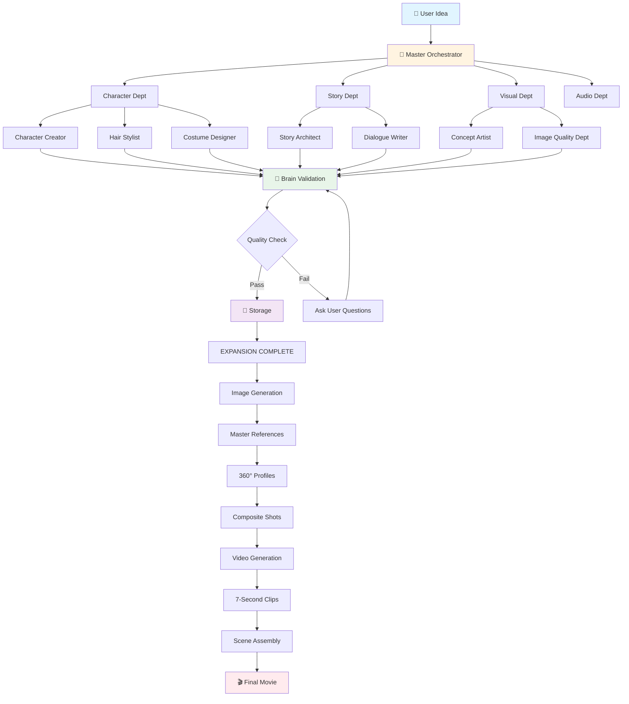

# Movie Making Process: Start to Finish

**Aladdin AI Movie Production Platform**  
*Complete workflow from idea to final video*

---

## 🎬 Overview

Aladdin transforms your movie idea into a complete video through a **chat-driven, AI-powered pipeline** with two main phases:

1. **EXPANSION** - Generate all story, character, and production data
2. **COMPACTING** - Transform text into visual media (images + videos)

---

## 📊 Complete Process Flow

```
┌─────────────────────────────────────────────────────────────┐
│                    💬 USER IDEA                             │
│          "Create a cyberpunk detective series"              │
└──────────────────────┬──────────────────────────────────────┘
                       ↓
┌─────────────────────────────────────────────────────────────┐
│                🤖 MASTER ORCHESTRATOR                       │
│          Analyzes request → Routes to departments           │
└──────────────────────┬──────────────────────────────────────┘
                       ↓
        ┌──────────────┴───────────────┬───────────────┐
        ↓                              ↓               ↓
┌───────────────┐           ┌──────────────┐   ┌─────────────┐
│ CHARACTER     │           │    STORY     │   │   VISUAL    │
│ DEPARTMENT    │           │  DEPARTMENT  │   │ DEPARTMENT  │
└───────┬───────┘           └──────┬───────┘   └──────┬──────┘
        ↓                          ↓                   ↓
┌─────────────────────────────────────────────────────────────┐
│           50+ SPECIALIST AGENTS EXECUTE TASKS               │
│  Character Creator | Hair Stylist | Story Architect         │
│  Costume Designer | World Builder | Concept Artist          │
└──────────────────────┬──────────────────────────────────────┘
                       ↓
┌─────────────────────────────────────────────────────────────┐
│                 🧠 THE BRAIN (Neo4j)                        │
│        Validates quality & consistency of all content        │
└──────────────────────┬──────────────────────────────────────┘
                       ↓
┌─────────────────────────────────────────────────────────────┐
│              📊 QUALITY RATING & REVIEW                     │
│         User decides: INGEST | MODIFY | DISCARD             │
└──────────────────────┬──────────────────────────────────────┘
                       ↓
┌─────────────────────────────────────────────────────────────┐
│            💾 STORAGE (MongoDB + PayloadCMS)                │
│        Only validated, approved content is saved            │
└─────────────────────────────────────────────────────────────┘
```

---

## 🎯 Phase 1: EXPANSION (Data Generation)

**Goal:** Create all story, character, and production data

### Process Flow

```
USER IDEA
    ↓
Master Orchestrator
    ↓
┌───────────────────────────────────┐
│   DEPARTMENT HEADS COORDINATE     │
├───────────────────────────────────┤
│ 1. Character Department           │
│    → Character profiles           │
│    → Relationships                │
│    → Character arcs               │
│                                   │
│ 2. Story Department               │
│    → Story structure              │
│    → Episode breakdown            │
│    → Scene descriptions           │
│    → Dialogue                     │
│                                   │
│ 3. Production Department          │
│    → Location details             │
│    → Props & assets               │
│    → Timeline                     │
└───────────────────────────────────┘
    ↓
Each item validated by Brain
    ↓
User reviews & approves
    ↓
EXPANSION COMPLETE ✓
```

### Example Content Generated

| Content Type | Example | Agent |
|-------------|---------|-------|
| **Character** | Sarah Chen - Detective, 32, street-smart | Character Creator |
| **Backstory** | Former tech analyst turned detective | Character Creator |
| **Appearance** | Short black hair, cyberpunk aesthetic | Hair Stylist + Costume Designer |
| **Voice** | Confident, mid-range, American accent | Voice Profile Creator |
| **Scene** | Opening sequence in neon-lit streets | Scene Director |
| **Dialogue** | "I've been tracking this case for weeks" | Dialogue Writer |
| **Location** | Neo Tokyo - Downtown District | Environment Designer |

---

## 🎨 Phase 2: COMPACTING (Visual Production)

**Goal:** Transform text into images and videos

### Image Generation Workflow

```
┌─────────────────────────────────────────────────────────────┐
│          IMAGE QUALITY DEPARTMENT                           │
└─────────────────────────────────────────────────────────────┘
                       ↓
┌─────────────────────────────────────────────────────────────┐
│ STEP 1: Create Master References                           │
│                                                             │
│  For each subject (character/location/prop):                │
│  1. Generate master reference image (highest quality)       │
│  2. Create 360° profile (12 views at 30° intervals)        │
│  3. Write detailed descriptions for each view               │
│  4. Store in reference database                             │
└──────────────────────┬──────────────────────────────────────┘
                       ↓
┌─────────────────────────────────────────────────────────────┐
│ STEP 2: Verify Consistency                                  │
│                                                             │
│  Brain checks all references:                               │
│  • Facial features match across views                       │
│  • Colors & proportions consistent                          │
│  • Style matches project aesthetic                          │
└──────────────────────┬──────────────────────────────────────┘
                       ↓
┌─────────────────────────────────────────────────────────────┐
│ STEP 3: Compose Shots                                       │
│                                                             │
│  Using references + AI model:                               │
│  • Character + location + props                             │
│  • Lighting & camera angle                                  │
│  • Verify against references                                │
└──────────────────────┬──────────────────────────────────────┘
                       ↓
              IMAGE READY FOR VIDEO ✓
```

### Video Generation Workflow

```
┌─────────────────────────────────────────────────────────────┐
│          VIDEO GENERATION (Max 7 seconds per clip)          │
└─────────────────────────────────────────────────────────────┘
                       ↓
┌─────────────────────────────────────────────────────────────┐
│ GENERATION METHODS (Choose One)                             │
│                                                             │
│ 1. Text-to-Video                                            │
│    Input: Scene description text                            │
│    Output: 7-second video clip                              │
│                                                             │
│ 2. Image-to-Video (Single Image)                            │
│    Input: One reference image + motion prompt               │
│    Output: Animated 7-second clip                           │
│                                                             │
│ 3. Image-to-Video (First + Last Frame)                      │
│    Input: Start image + end image                           │
│    Output: Smooth transition 7-second clip                  │
│                                                             │
│ 4. Composite-to-Video                                       │
│    Input: Composite image + action description              │
│    Output: 7-second clip with character/location            │
└──────────────────────┬──────────────────────────────────────┘
                       ↓
┌─────────────────────────────────────────────────────────────┐
│         QUALITY CHECK                                       │
│  • Resolution correct?                                      │
│  • Duration ≤ 7 seconds?                                    │
│  • Character consistency maintained?                        │
│  • Motion quality natural?                                  │
└──────────────────────┬──────────────────────────────────────┘
                       ↓
            USER REVIEWS VIDEO CLIP
                       ↓
            INGEST | REGENERATE | DISCARD
```

### Scene Assembly (30-Second Scene Example)

```
┌─────────────────────────────────────────────────────────────┐
│              MULTI-CLIP ASSEMBLY                            │
│                                                             │
│  30-second scene = 5 clips                                  │
│                                                             │
│  Clip 1: 0-7s   (Opening shot)                              │
│  Clip 2: 7-14s  (Character enters)                          │
│  Clip 3: 14-21s (Action sequence)                           │
│  Clip 4: 21-28s (Reaction shot)                             │
│  Clip 5: 28-30s (Transition)                                │
│                                                             │
│  + Dialogue audio                                           │
│  + Background music                                         │
│  + Sound effects                                            │
│  + Transitions (cuts/fades)                                 │
│  + Color grading                                            │
└──────────────────────┬──────────────────────────────────────┘
                       ↓
              COMPLETE SCENE READY ✓
```

---

## 🗺️ Mermaid Flow Diagram



---

## 🏗️ System Architecture

```
┌─────────────────────────────────────────────────────────────┐
│                     CHAT INTERFACE                          │
│              User talks with AI in natural language         │
└──────────────────────┬──────────────────────────────────────┘
                       ↓
┌─────────────────────────────────────────────────────────────┐
│                   NEXT.JS + PAYLOADCMS                      │
│              Web framework + Content Management             │
└──────────────────────┬──────────────────────────────────────┘
                       ↓
        ┌──────────────┴──────────────┐
        ↓                             ↓
┌──────────────────┐          ┌──────────────────┐
│   MongoDB #1     │          │   MongoDB #2     │
│  (Structured)    │          │  (Open/Flexible) │
│  Projects        │          │  Characters      │
│  Users           │          │  Scenes          │
│  Media           │          │  Dialogue        │
└──────────────────┘          └──────────────────┘
        │                             │
        └──────────────┬──────────────┘
                       ↓
┌─────────────────────────────────────────────────────────────┐
│                  THE BRAIN (Neo4j)                          │
│           Knowledge Graph + Quality Validation              │
└──────────────────────┬──────────────────────────────────────┘
                       ↓
┌─────────────────────────────────────────────────────────────┐
│              AI AGENTS (@codebuff/sdk)                      │
│                 50+ Specialized Agents                      │
│                                                             │
│  Master Orchestrator → Department Heads → Specialists       │
└─────────────────────────────────────────────────────────────┘
                       ↓
┌─────────────────────────────────────────────────────────────┐
│              EXTERNAL SERVICES                              │
│  • FAL.ai (Images & Videos)                                 │
│  • ElevenLabs (Voice)                                       │
│  • Cloudflare R2 (Storage)                                  │
└─────────────────────────────────────────────────────────────┘
```

---

## 📋 Key Concepts

### 1. Chat-Driven Pipeline
- User converses naturally with AI
- No rigid forms or workflows
- Can add content in any order
- AI adapts to conversation flow

### 2. Quality Gates
- **The Brain validates everything**
- Quality rating: 0.0 - 1.0
- Only qualified content saved
- User always has final approval

### 3. Hierarchical Agents
```
Master Orchestrator (1)
    ↓
Department Heads (5-7)
    ↓
Specialist Agents (50+)
```

### 4. Reference-Based Generation
- Master reference images created first
- 360° profiles ensure consistency
- All videos use references
- Brain verifies against references

### 5. User Control Points

| Stage | User Decision |
|-------|--------------|
| Content Generation | INGEST, MODIFY, or DISCARD |
| Image Generation | INGEST, REGENERATE, or DISCARD |
| Video Generation | INGEST, REGENERATE, or DISCARD |
| Scene Assembly | APPROVE, ADJUST, or REJECT |

---

## 🎯 Quality Scoring

| Score | Rating | Action |
|-------|--------|--------|
| 0.90 - 1.00 | ⭐⭐⭐⭐⭐ Excellent | Ready for production |
| 0.75 - 0.89 | ⭐⭐⭐⭐☆ Good | Minor refinements suggested |
| 0.60 - 0.74 | ⭐⭐⭐☆☆ Acceptable | Consider revision |
| 0.40 - 0.59 | ⭐⭐☆☆☆ Weak | Recommend regeneration |
| 0.00 - 0.39 | ⭐☆☆☆☆ Poor | Discard and start over |

---

## 📊 Timeline Example

**Creating a 5-Minute Short Film:**

| Phase | Duration | Activities |
|-------|----------|-----------|
| **Story Development** | 1-2 hours | Characters, plot, scenes, dialogue |
| **Image References** | 2-3 hours | Master refs, 360° profiles, composites |
| **Video Generation** | 4-6 hours | Generate clips (5 min = 42 clips @ 7s each) |
| **Scene Assembly** | 2-3 hours | Audio, transitions, effects, rendering |
| **Review & Adjustments** | 1-2 hours | Final tweaks, quality check |
| **TOTAL** | 10-16 hours | Fully produced 5-minute film |

*Note: Actual time varies based on complexity and iterations*

---

## 🔄 Complete Workflow Summary

```
1. USER IDEA
   ↓
2. AI GENERATES CONTENT (text/data)
   ↓
3. BRAIN VALIDATES QUALITY
   ↓
4. USER REVIEWS & APPROVES
   ↓
5. CONTENT SAVED (Expansion Phase)
   ↓
6. REPEAT until story complete
   ↓
7. GENERATE MASTER REFERENCES
   ↓
8. CREATE 360° PROFILES
   ↓
9. COMPOSE SHOTS
   ↓
10. GENERATE VIDEO CLIPS (7s max)
    ↓
11. USER REVIEWS EACH CLIP
    ↓
12. ASSEMBLE SCENES
    ↓
13. ADD AUDIO & EFFECTS
    ↓
14. FINAL MOVIE COMPLETE! 🎬
```

---

## 💡 Simple Example: "Create Sarah, a Detective"

**Step-by-Step:**

1. **User:** "Create a cyberpunk detective named Sarah"

2. **Master Orchestrator:** Routes to Character Department

3. **Character Department Head:** Spawns specialists:
   - Character Creator → Personality & backstory
   - Hair Stylist → Short black hair design
   - Costume Designer → Orange detective jacket
   - Voice Creator → Voice profile

4. **Brain:** Validates all outputs for quality & consistency

5. **User:** Reviews complete character profile (Quality: 0.87 ⭐⭐⭐⭐⭐)

6. **User:** Chooses "INGEST"

7. **Sarah saved** to project database

8. **Later - Image Generation:**
   - Master reference image created
   - 360° profile generated (12 views)
   - Descriptions written for each

9. **Video Generation:**
   - "Sarah walks down neon street" → 7s clip
   - User reviews → INGEST

10. **Sarah is now ready for scenes!** ✓

---

**End of Document**
