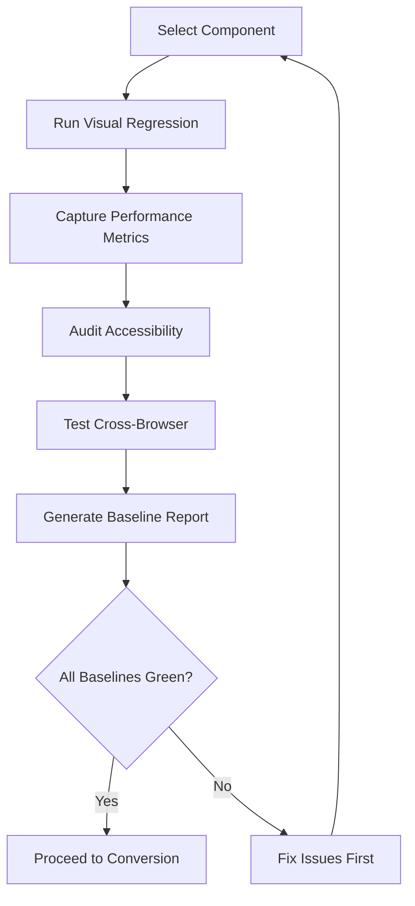
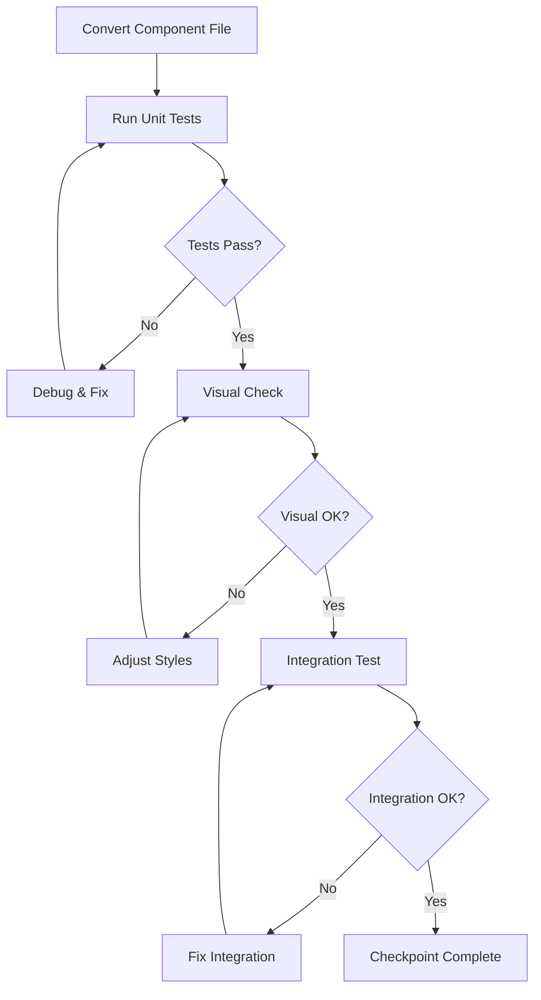
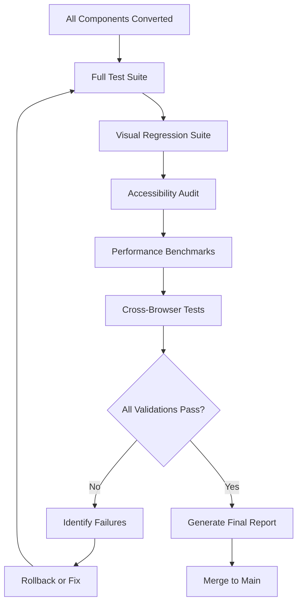

# Component Conversion Testing Strategy

**Version**: 1.0
**Created**: October 2025
**Status**: Implementation Ready
**Agent**: Tester (Hive Mind)

---

## 📋 Executive Summary

This document defines the comprehensive testing strategy for converting React components from `index-old.tsx` patterns to standalone modern components. The strategy ensures visual consistency, functional correctness, accessibility compliance, and zero regressions during the migration.

### Key Objectives

1. **Zero Regression**: No functionality is lost during conversion
2. **Visual Parity**: Converted components match existing UI exactly
3. **Accessibility Maintained**: WCAG 2.1 Level AA compliance preserved
4. **Performance**: No degradation in render performance
5. **Type Safety**: Full TypeScript coverage maintained

---

## 🔍 Test Requirements Analysis

### 1. Visual Regression Testing

**Critical for**: All UI components with visual representation

**Requirements**:
- **Snapshot Testing**: Capture before/after visual states
- **Pixel-Perfect Comparison**: Automated visual diff detection
- **Responsive Testing**: Verify all breakpoints (mobile, tablet, desktop)
- **Theme Testing**: Light/dark mode consistency
- **State Variations**: All visual states (hover, active, disabled, loading)

**Tools**:
- Playwright for visual regression
- Percy/Chromatic for visual diff (optional)
- React Testing Library for component snapshots

**Coverage Areas**:
```typescript
// Visual regression test matrix
const visualTests = {
  states: ['default', 'hover', 'active', 'disabled', 'loading', 'error'],
  themes: ['light', 'dark'],
  viewports: [
    { width: 375, height: 667 },   // Mobile
    { width: 768, height: 1024 },  // Tablet
    { width: 1920, height: 1080 }  // Desktop
  ]
}
```

### 2. Functional Testing

**Critical for**: All components with user interaction

**Requirements**:
- **Unit Tests**: Component logic in isolation
- **Integration Tests**: Component interaction with stores/APIs
- **User Interaction**: Click, keyboard, touch events
- **State Management**: Zustand store integration
- **Props Validation**: Type safety and prop changes
- **Error Handling**: Edge cases and error boundaries

**Test Patterns**:
```typescript
describe('Component Functionality', () => {
  describe('User Interactions', () => {
    it('handles click events correctly')
    it('supports keyboard navigation')
    it('responds to touch gestures')
  })

  describe('State Management', () => {
    it('updates store on user action')
    it('reflects store changes in UI')
    it('handles concurrent updates')
  })

  describe('Error Handling', () => {
    it('displays error states appropriately')
    it('recovers from errors gracefully')
    it('logs errors for debugging')
  })
})
```

### 3. Accessibility Testing

**Critical for**: ALL components (mandatory)

**Requirements**:
- **Keyboard Navigation**: Full keyboard accessibility
- **Screen Reader Support**: Proper ARIA labels and roles
- **Focus Management**: Logical focus order, visible indicators
- **Color Contrast**: WCAG AA compliance (4.5:1 normal, 3:1 large text)
- **Semantic HTML**: Proper heading hierarchy, landmarks
- **Interactive Elements**: Sufficient touch target sizes (44x44px minimum)

**Testing Checklist**:
```typescript
// Accessibility test suite
const a11yTests = {
  keyboard: [
    'Tab navigation through all interactive elements',
    'Enter/Space activate buttons/links',
    'Escape closes modals/menus',
    'Arrow keys navigate lists/menus',
    'No keyboard traps'
  ],
  screenReader: [
    'All images have alt text',
    'Buttons have accessible names',
    'Form inputs have labels',
    'Dynamic content announced (ARIA live regions)',
    'Heading hierarchy is logical (h1 → h2 → h3)'
  ],
  focus: [
    'Focus visible on all interactive elements',
    'Focus order matches visual order',
    'Focus restored after modal close',
    'Skip links available for navigation'
  ]
}
```

**Tools**:
- `@testing-library/react` for interaction testing
- `axe-core` / `jest-axe` for automated a11y checks
- Manual testing with screen readers (NVDA, VoiceOver)

### 4. Cross-Browser Compatibility

**Critical for**: Components with complex CSS or browser-specific features

**Requirements**:
- **Browser Matrix**: Chrome, Firefox, Safari, Edge
- **Version Coverage**: Current + 2 previous major versions
- **Feature Detection**: Graceful degradation for unsupported features
- **Polyfills**: Ensure compatibility for older browsers

**Test Matrix**:
```typescript
const browserMatrix = {
  Chrome: ['latest', 'latest-1', 'latest-2'],
  Firefox: ['latest', 'latest-1'],
  Safari: ['latest', 'latest-1'],
  Edge: ['latest']
}
```

**Playwright Configuration**:
```typescript
// playwright.config.ts
projects: [
  { name: 'chromium', use: { ...devices['Desktop Chrome'] } },
  { name: 'firefox', use: { ...devices['Desktop Firefox'] } },
  { name: 'webkit', use: { ...devices['Desktop Safari'] } },
  { name: 'edge', use: { ...devices['Desktop Edge'] } }
]
```

### 5. Performance Testing

**Critical for**: Components rendering lists or complex data

**Requirements**:
- **Render Performance**: Initial render < 100ms
- **Re-render Optimization**: Minimize unnecessary re-renders
- **Bundle Size**: No significant increase post-conversion
- **Memory Usage**: No memory leaks
- **LCP (Largest Contentful Paint)**: < 2.5s

**Metrics to Track**:
```typescript
// Performance benchmarks
const performanceMetrics = {
  initialRender: 100,      // ms
  reRenderTime: 16,        // ms (60fps target)
  bundleSize: 50,          // KB increase limit
  memoryUsage: 10,         // MB increase limit
  componentMountTime: 50   // ms
}
```

---

## 📁 Existing Test Structure Analysis

### Current Test Organization

```
tests/
├── e2e/                          # End-to-end tests (Playwright)
│   ├── 00-auth-and-setup.spec.ts
│   ├── 01-page-loading.spec.ts
│   ├── 02-project-pages.spec.ts
│   ├── 03-orchestrator-components.spec.ts
│   ├── 04-navigation-flow.spec.ts
│   ├── 05-responsive-layout.spec.ts
│   └── dashboard-comprehensive.spec.ts
│
├── ui/                           # UI-specific tests (Vitest + RTL)
│   ├── unit/
│   │   ├── layout/TopMenuBar.test.tsx
│   │   ├── layout/LeftSidebar.test.tsx
│   │   ├── layout/RightOrchestrator.test.tsx
│   │   └── orchestrator/[modes].test.tsx
│   ├── integration/
│   │   └── orchestrator-query-flow.test.tsx
│   ├── a11y/
│   │   └── keyboard-navigation.test.tsx
│   ├── e2e/
│   │   └── orchestrator-query.spec.ts
│   └── performance/
│       └── initial-load.test.ts
│
├── int/                          # Integration tests
│   ├── components/
│   │   ├── ProjectSidebar.spec.tsx
│   │   ├── Timeline.spec.tsx
│   │   └── QualityDashboard.spec.tsx
│   └── [other integration tests]
│
└── performance/
    └── benchmarks.spec.ts
```

### Test Framework Stack

**Current Setup** (from `package.json` and configs):
- **Unit/Integration**: Vitest 3.2.3 + @testing-library/react 16.3.0
- **E2E**: Playwright 1.54.1
- **Environment**: jsdom for component tests
- **React Version**: React 19.1.0

**Configuration Files**:
- `vitest.config.mts`: Unit/integration tests (includes `tests/int/**/*.int.spec.ts`)
- `playwright.config.ts`: E2E tests (includes `tests/e2e/**/*.spec.ts`)
- `vitest.setup.ts`: Test environment setup

### Test Patterns Observed

**1. Unit Test Pattern** (TopMenuBar.test.tsx):
```typescript
describe('Component', () => {
  describe('Rendering', () => { /* visual checks */ })
  describe('Interactions', () => { /* user events */ })
  describe('Keyboard Accessibility', () => { /* a11y */ })
  describe('Edge Cases', () => { /* error handling */ })
  describe('Responsive Behavior', () => { /* breakpoints */ })
})
```

**2. E2E Test Pattern** (05-responsive-layout.spec.ts):
```typescript
test.describe('Feature - Desktop', () => {
  test.use({ viewport: { width: 1920, height: 1080 } })
  test('scenario', async ({ page }) => { /* test */ })
})
```

**3. Integration Test Pattern** (orchestrator-query-flow.test.tsx):
```typescript
describe('Feature Integration', () => {
  beforeEach(() => { /* setup mocks */ })
  it('completes full workflow', async () => { /* multi-step test */ })
})
```

---

## 🎯 Component Test Classification

### Priority 1: Critical Path Components (MUST TEST FIRST)

**Components**:
- `RightOrchestrator/index.tsx` (main orchestrator)
- `RightOrchestrator/ChatArea.tsx`
- `RightOrchestrator/MessageInput.tsx`
- `RightOrchestrator/ModeSelector.tsx`
- `TopMenuBar/index.tsx`
- `LeftSidebar/index.tsx`

**Test Requirements**:
- ✅ Full unit test suite (rendering, interactions, a11y)
- ✅ Integration tests (store interactions, API calls)
- ✅ E2E tests (complete user workflows)
- ✅ Visual regression (all states + themes)
- ✅ Performance benchmarks
- ✅ Cross-browser validation

**Test Update Strategy**: **NEW TESTS REQUIRED**
- Existing tests are placeholders/mocks
- Need comprehensive test coverage before conversion
- Baseline tests must pass 100% before starting conversion

### Priority 2: Supporting Components (TEST DURING CONVERSION)

**Components**:
- `RightOrchestrator/modes/QueryMode.tsx`
- `RightOrchestrator/modes/ChatMode.tsx`
- `RightOrchestrator/modes/DataMode.tsx`
- `RightOrchestrator/modes/TaskMode.tsx`
- `TopMenuBar/ProjectSelector.tsx`
- `TopMenuBar/Breadcrumbs.tsx`
- `LeftSidebar/Navigation.tsx`

**Test Requirements**:
- ✅ Unit tests (props, state, events)
- ✅ Integration with parent components
- ✅ Accessibility compliance
- ⚠️ Visual regression (key states only)
- ⚠️ Basic performance checks

**Test Update Strategy**: **UPDATE EXISTING TESTS**
- Extend existing test files with actual component logic
- Add missing edge cases
- Ensure parent-child interaction tests

### Priority 3: Utility Components (TEST AS NEEDED)

**Components**:
- `RightOrchestrator/components/CodeBlock.tsx`
- `RightOrchestrator/components/StreamingMessage.tsx`
- `RightOrchestrator/components/MessageList.tsx`
- `RightOrchestrator/components/Message.tsx`
- `animated/*` components
- `loading/*` components
- `a11y/*` components

**Test Requirements**:
- ✅ Unit tests (props validation, rendering)
- ⚠️ Edge case testing
- ⚠️ Accessibility (if interactive)

**Test Update Strategy**: **MINIMAL TESTING**
- Simple prop-based tests
- Visual snapshot tests
- No deep integration testing required

---

## 📝 Testing Checklists

### Pre-Conversion Testing Checklist (Baseline)

**Purpose**: Capture current behavior before any changes

**Steps**:

1. **Visual Baseline Capture**
   - [ ] Run full Playwright visual regression suite
   - [ ] Capture screenshots for all states (default, hover, active, etc.)
   - [ ] Save screenshots in `tests/baselines/[component-name]/`
   - [ ] Document any existing visual bugs/inconsistencies

2. **Functional Baseline**
   - [ ] Run existing unit tests: `pnpm run test:int`
   - [ ] Run E2E tests: `pnpm run test:e2e`
   - [ ] Document test pass rate (target: 100%)
   - [ ] Identify flaky tests and fix before conversion

3. **Performance Baseline**
   - [ ] Run performance benchmarks: `pnpm run test:performance` (if exists)
   - [ ] Measure component render times
   - [ ] Measure bundle size: `pnpm run build` + analyze
   - [ ] Record baseline metrics in `tests/baselines/performance.json`

4. **Accessibility Audit**
   - [ ] Run axe DevTools on component
   - [ ] Test keyboard navigation manually
   - [ ] Test with screen reader (NVDA/VoiceOver)
   - [ ] Document current a11y score (0 violations = 100%)

5. **Cross-Browser Check**
   - [ ] Test in Chrome, Firefox, Safari, Edge
   - [ ] Document browser-specific issues
   - [ ] Verify feature parity across browsers

**Output**: Baseline report in `tests/baselines/[component-name]/BASELINE_REPORT.md`

### During-Conversion Testing Checklist

**Purpose**: Catch regressions early during development

**Steps**:

1. **Incremental Testing** (after each file conversion)
   - [ ] Run unit tests for converted component
   - [ ] Run integration tests with parent/child components
   - [ ] Quick visual check in browser (manual)
   - [ ] Verify TypeScript types are correct

2. **Checkpoint Testing** (after completing a component group)
   - [ ] Run full test suite for the feature area
   - [ ] Visual regression comparison vs baseline
   - [ ] Accessibility audit (automated + manual)
   - [ ] Performance comparison (should be ±5% of baseline)

3. **Continuous Validation**
   - [ ] Keep tests passing at all times
   - [ ] Fix failing tests before moving to next component
   - [ ] Update snapshots only when intentional changes made

**Red Flags** (stop and fix immediately):
- ❌ Test pass rate drops below 95%
- ❌ Visual regressions detected
- ❌ New a11y violations introduced
- ❌ Performance degrades >10%
- ❌ TypeScript errors appear

### Post-Conversion Testing Checklist (Validation)

**Purpose**: Final validation before merging

**Steps**:

1. **Full Test Suite Execution**
   - [ ] Run all unit tests: `pnpm run test:int` (100% pass required)
   - [ ] Run all E2E tests: `pnpm run test:e2e` (100% pass required)
   - [ ] Run performance tests (within 10% of baseline)

2. **Visual Regression Validation**
   - [ ] Compare new screenshots vs baseline
   - [ ] Approve intentional visual changes
   - [ ] Reject unintentional differences (fix before merge)
   - [ ] Update approved baselines

3. **Accessibility Re-Audit**
   - [ ] Run automated axe tests (0 violations)
   - [ ] Manual keyboard navigation test (100% functional)
   - [ ] Screen reader test (no regressions)
   - [ ] Color contrast check (all pass WCAG AA)

4. **Cross-Browser Final Check**
   - [ ] Test in all browsers from matrix
   - [ ] Verify no new browser-specific bugs
   - [ ] Confirm feature parity maintained

5. **Performance Validation**
   - [ ] Bundle size within acceptable range (<5% increase)
   - [ ] Render performance maintained or improved
   - [ ] No memory leaks detected
   - [ ] LCP/FID/CLS metrics within thresholds

6. **Code Quality Check**
   - [ ] TypeScript strict mode compliance
   - [ ] ESLint warnings resolved
   - [ ] Code coverage ≥80% for new/changed code
   - [ ] No console errors/warnings

**Approval Criteria**:
- ✅ All tests passing (100%)
- ✅ Visual parity confirmed
- ✅ Accessibility maintained
- ✅ Performance acceptable
- ✅ Code quality standards met

---

## 🔄 Testing Workflow

### Phase 1: Pre-Conversion (Baseline Establishment)



**Timeline**: 1-2 hours per component
**Owner**: Tester agent
**Deliverable**: Baseline report + screenshots + metrics

### Phase 2: Conversion + Testing (Iterative)



**Timeline**: 2-4 hours per component
**Owner**: Coder agent (conversion) + Tester agent (validation)
**Deliverable**: Converted component + passing tests

### Phase 3: Post-Conversion (Final Validation)



**Timeline**: 2-4 hours for full validation
**Owner**: Reviewer agent + Tester agent
**Deliverable**: Final validation report + approval

---

## 🚨 Rollback Criteria

### When to Rollback Conversion

**Immediate Rollback Triggers**:

1. **Critical Functionality Broken**
   - Primary user workflow fails (e.g., orchestrator can't send messages)
   - Data loss or corruption occurs
   - Authentication/authorization broken
   - API integration fails

2. **Severe Performance Degradation**
   - Render time increases >30%
   - Bundle size increases >20%
   - Memory leaks detected
   - Page becomes unresponsive

3. **Accessibility Regressions**
   - Keyboard navigation broken
   - Screen reader functionality lost
   - WCAG violations introduced
   - Focus management broken

4. **Visual Regressions (if critical)**
   - Layout completely broken
   - Content invisible or overlapping
   - Responsive design broken
   - Theme rendering broken

**Rollback Process**:

```bash
# 1. Immediately revert the conversion
git revert [conversion-commit-hash]

# 2. Restore old files
git checkout [previous-commit] -- src/components/[component-path]

# 3. Verify rollback
pnpm run test        # All tests should pass
pnpm run dev         # Manual verification

# 4. Document issue
# Create issue with:
# - What broke
# - How to reproduce
# - Baseline vs actual metrics
# - Proposed fix approach

# 5. Fix in isolation
# Create new branch
# Fix issues
# Re-run full test suite
# Attempt conversion again
```

**Partial Rollback** (if only part of a feature is broken):
- Rollback specific file(s) only
- Keep passing components
- Fix and re-integrate broken parts

### Prevention Strategies

1. **Feature Flags**: Wrap converted components in feature flags
   ```typescript
   const useNewComponent = process.env.NEXT_PUBLIC_USE_NEW_ORCHESTRATOR === 'true'

   return useNewComponent ? <NewOrchestrator /> : <OldOrchestrator />
   ```

2. **Gradual Rollout**: Deploy to staging first, then production
3. **Monitoring**: Set up alerts for errors/performance drops
4. **User Feedback**: Monitor user reports closely post-deployment

---

## 📊 Test Coverage Goals

### Coverage Targets (Per Component)

| Test Type | Target Coverage | Priority 1 | Priority 2 | Priority 3 |
|-----------|----------------|-----------|-----------|-----------|
| **Line Coverage** | 80%+ | ✅ Required | ✅ Required | ⚠️ 60%+ |
| **Branch Coverage** | 75%+ | ✅ Required | ⚠️ 70%+ | ⚠️ 50%+ |
| **Function Coverage** | 80%+ | ✅ Required | ⚠️ 70%+ | ⚠️ 60%+ |
| **Visual Regression** | 100% states | ✅ Required | ⚠️ Key states | ❌ Optional |
| **A11y Compliance** | WCAG 2.1 AA | ✅ Required | ✅ Required | ✅ Required |
| **Browser Coverage** | 4 browsers | ✅ Required | ⚠️ 2 browsers | ❌ Chrome only |

### Overall Project Goals

- **Total Line Coverage**: ≥80% (current baseline)
- **Zero A11y Violations**: Maintain 0 axe violations
- **E2E Test Pass Rate**: 100%
- **Visual Regression**: <1% unintended pixel difference
- **Performance Budget**: No component >100ms initial render

---

## 🛠️ Testing Tools & Commands

### Test Execution Commands

```bash
# Unit/Integration Tests (Vitest)
pnpm run test:int                    # Run all integration tests
pnpm run test:int -- --watch         # Watch mode
pnpm run test:int -- --coverage      # With coverage report

# E2E Tests (Playwright)
pnpm run test:e2e                    # Run E2E tests (headless)
pnpm run test:e2e:headed             # Run with browser visible
pnpm run test:e2e:ui                 # Run with Playwright UI
pnpm run test:e2e:dashboard          # Run dashboard-specific tests

# Specific test file
pnpm exec vitest tests/ui/unit/layout/TopMenuBar.test.tsx
pnpm exec playwright test tests/e2e/05-responsive-layout.spec.ts

# Visual regression (Playwright)
pnpm exec playwright test --update-snapshots  # Update baselines

# Accessibility audit
pnpm exec playwright test tests/ui/a11y/keyboard-navigation.test.tsx
```

### Recommended Additional Tools

```bash
# Install (optional enhancements)
pnpm add -D @axe-core/playwright      # Automated a11y testing
pnpm add -D jest-axe                  # A11y for Vitest
pnpm add -D @testing-library/user-event  # Better user simulation

# Visual regression (external service)
pnpm add -D @percy/playwright         # Percy for visual diffs
pnpm add -D chromatic                 # Chromatic for Storybook
```

### Test Debugging

```bash
# Debug failing test (Vitest)
pnpm exec vitest --inspect-brk tests/ui/unit/layout/TopMenuBar.test.tsx

# Debug E2E test (Playwright)
pnpm exec playwright test --debug tests/e2e/03-orchestrator-components.spec.ts

# View test report
pnpm exec playwright show-report      # After E2E test run
```

---

## 📈 Success Metrics

### Test Quality Indicators

**Green Metrics** (all must be true):
- ✅ 100% test pass rate
- ✅ 0 accessibility violations
- ✅ Visual parity score >99%
- ✅ Performance within ±10% baseline
- ✅ 0 TypeScript errors
- ✅ Code coverage ≥80%

**Yellow Metrics** (acceptable with justification):
- ⚠️ Test pass rate 95-99% (flaky tests documented)
- ⚠️ Minor visual differences <1% (intentional changes documented)
- ⚠️ Performance degrades 10-20% (optimization plan in place)
- ⚠️ Code coverage 70-80% (complex logic hard to test)

**Red Metrics** (block merge):
- ❌ Test pass rate <95%
- ❌ New a11y violations
- ❌ Visual regressions >1% (unintentional)
- ❌ Performance degrades >20%
- ❌ Code coverage <70%

---

## 🤝 Coordination with Other Agents

### Memory Sharing Protocol

**Store test findings in hive memory**:

```bash
# After baseline capture
npx claude-flow@alpha hooks post-edit \
  --file "tests/baselines/[component]/BASELINE_REPORT.md" \
  --memory-key "swarm/tester/baselines/[component]"

# After conversion validation
npx claude-flow@alpha hooks post-edit \
  --file "tests/validation/[component]/VALIDATION_REPORT.md" \
  --memory-key "swarm/tester/validation/[component]"

# Share test results with coordinator
npx claude-flow@alpha hooks notify \
  --message "Component [name] testing complete: [PASS/FAIL]" \
  --level "success|warning|error"
```

### Integration Points with Other Agents

**With Analyzer Agent**:
- Receive component complexity analysis
- Use complexity to determine test depth
- Share test coverage gaps for improvement

**With Coder Agent**:
- Provide test-driven requirements
- Share failing test details for fixes
- Coordinate on test updates during refactoring

**With Reviewer Agent**:
- Share test quality metrics
- Provide coverage reports for review
- Coordinate on approval criteria

**With Coordinator Agent**:
- Report conversion readiness status
- Escalate critical test failures
- Provide rollback recommendations

---

## 📝 Test Documentation Template

### Baseline Report Template

```markdown
# Component Baseline Report

**Component**: [Component Name]
**Date**: [Date]
**Tester**: Tester Agent (Hive Mind)

## Visual Baseline
- Screenshots captured: [count]
- Baseline location: `tests/baselines/[component]/screenshots/`
- Known visual issues: [list or "none"]

## Functional Baseline
- Unit tests: [pass/total] ([percentage]%)
- Integration tests: [pass/total] ([percentage]%)
- E2E tests: [pass/total] ([percentage]%)

## Performance Baseline
- Initial render: [X]ms
- Re-render: [X]ms
- Bundle size: [X]KB
- Memory usage: [X]MB

## Accessibility Baseline
- Axe violations: [count]
- Keyboard navigation: [PASS/FAIL]
- Screen reader: [PASS/FAIL]
- WCAG compliance: [AA/AAA/FAIL]

## Cross-Browser Status
- Chrome: [PASS/FAIL]
- Firefox: [PASS/FAIL]
- Safari: [PASS/FAIL]
- Edge: [PASS/FAIL]

## Conversion Readiness
- **Status**: [READY/BLOCKED]
- **Blockers**: [list or "none"]
- **Recommendations**: [recommendations]
```

### Validation Report Template

```markdown
# Component Validation Report

**Component**: [Component Name]
**Date**: [Date]
**Tester**: Tester Agent (Hive Mind)

## Test Execution Results
- Total tests run: [count]
- Passed: [count] ([percentage]%)
- Failed: [count] ([percentage]%)
- Skipped: [count]

## Visual Regression Results
- Total comparisons: [count]
- Matches: [count]
- Differences: [count]
- Approved changes: [count]
- Regressions: [count]

## Performance Comparison
| Metric | Baseline | Current | Diff | Status |
|--------|----------|---------|------|--------|
| Initial render | [X]ms | [Y]ms | [+/-Z]% | [✅/⚠️/❌] |
| Re-render | [X]ms | [Y]ms | [+/-Z]% | [✅/⚠️/❌] |
| Bundle size | [X]KB | [Y]KB | [+/-Z]% | [✅/⚠️/❌] |

## Accessibility Validation
- Axe violations: [count] (target: 0)
- Keyboard navigation: [PASS/FAIL]
- Screen reader: [PASS/FAIL]
- WCAG compliance: [MAINTAINED/REGRESSED]

## Approval Decision
- **Decision**: [APPROVED/REJECTED/NEEDS_FIXES]
- **Confidence**: [HIGH/MEDIUM/LOW]
- **Blockers**: [list or "none"]
- **Next Steps**: [next steps]
```

---

## 🚀 Implementation Timeline

### Suggested Testing Schedule

**Week 1: Setup & Priority 1 Baselines**
- Day 1-2: Setup testing infrastructure, configure tools
- Day 3-5: Capture baselines for Priority 1 components (6 components)

**Week 2: Priority 1 Conversions + Tests**
- Day 1-3: Convert + test RightOrchestrator components (3 components)
- Day 4-5: Convert + test TopMenuBar, LeftSidebar (2 components)

**Week 3: Priority 2 Conversions + Tests**
- Day 1-3: Convert + test mode components (4 components)
- Day 4-5: Convert + test sub-components (3 components)

**Week 4: Priority 3 + Final Validation**
- Day 1-2: Convert + test utility components (as needed)
- Day 3-4: Full regression suite, cross-browser testing
- Day 5: Final validation, documentation, merge

---

## 📚 References

### Related Documentation
- [Component Analysis Report](./COMPONENT_ANALYSIS_REPORT.md) (from Analyzer agent)
- [Conversion Priorities](./CONVERSION_PRIORITIES.md) (from Coordinator agent)
- [Code Style Guide](./CODE_STYLE_GUIDE.md)
- [Accessibility Guidelines](./ACCESSIBILITY_GUIDELINES.md)

### External Resources
- [Vitest Documentation](https://vitest.dev/)
- [Playwright Documentation](https://playwright.dev/)
- [Testing Library Best Practices](https://testing-library.com/docs/queries/about)
- [WCAG 2.1 Guidelines](https://www.w3.org/WAI/WCAG21/quickref/)
- [Web Performance Metrics](https://web.dev/metrics/)

---

**Document Status**: ✅ Complete and ready for implementation

**Next Steps**:
1. Share this document with hive mind via memory hooks
2. Coordinate with Coordinator agent on execution timeline
3. Begin baseline testing for Priority 1 components
4. Report progress daily via memory updates

---

*This testing strategy ensures zero-regression component conversions while maintaining code quality, accessibility, and performance standards.*
